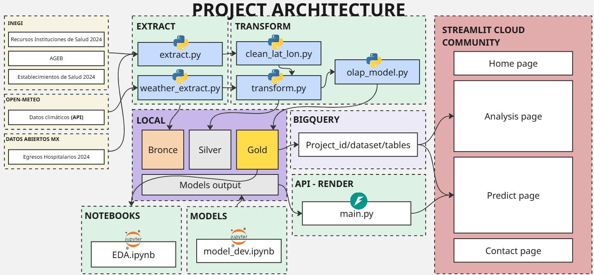
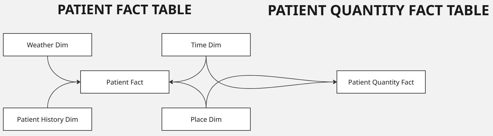

# Predictive Health Resources *(MVP)*

## Descripción y objetivo del proyecto:

**Situación Inicial**

Durante 2024, los servicios de salud en distintas CLUES del país enfrentaron variaciones significativas en la afluencia de pacientes. En algunas semanas se registraban saturaciones inesperadas en urgencias y consultas externas, mientras que en otras los recursos quedaban subutilizados. Esta falta de previsión dificultaba la planeación de personal, camas y suministros en todo el sistema.

Ante este panorama, se desarrolló un modelo predictivo capaz de estimar la cantidad de pacientes esperados por establecimiento, fecha y características del servicio. A partir de datos históricos y variables operativas, la herramienta permite anticipar la demanda y optimizar la asignación de recursos en las distintas unidades de salud, mejorando la eficiencia y la capacidad de respuesta.

Se busca:

1️⃣ Analizar y buscar patrones en los datos

2️⃣ Preparar hipotesis para entender el comportamiento de los pacientes

3️⃣ Preparar Modelo Estrella de los datos

4️⃣ Crear modelo predictivo de la cantidad de pacientes

5️⃣ Desplegar proyecto

## Arquitectura del proyecto

El esquema general del proyecto es el siguiente:

## Diccionario de datos

### Fuentes utilizadas

- [Egresos Hospitalarios 2024](https://datos.gob.mx/dataset/datos_egresos_hospitalarios)
- [Recursos Instituciones de Salud 2024](https://www.inegi.org.mx/programas/salud/#datos_abiertos)
- [API Clima](https://open-meteo.com/)
- **Establecimientos de Salud** *(No se provee link, ya que los recursos ya no se encuentran disponibles)*
- [AGEB](https://www.inegi.org.mx/app/ageeml/)

### Diccionario de datos del Modelo Estrella

#### 1️⃣ **Dimensión de tiempo**

| Nombre de la columna | Tipo de dato | Descripción                                 |
| -------------------- | ------------ | ------------------------------------------- |
| id_time              | INT          | Identificador único del registro de tiempo. |
| fecha                | VARCHAR(255) | Fecha completa (AAAA-MM-DD).                |
| year                 | INT          | Año correspondiente a la fecha.             |
| quarter              | INT          | Trimestre del año (1 a 4).                  |
| month                | INT          | Mes numérico (1 a 12).                      |
| day                  | INT          | Día del mes.                                |
| weekday              | INT          | Día de la semana (1=lunes, 7=domingo).      |

---

#### 2️⃣ **Dimensión de lugar**

| Nombre de la columna | Tipo de dato  | Descripción                                      |
| -------------------- | ------------- | ------------------------------------------------ |
| id_place             | INT           | Identificador único del lugar o centro médico.   |
| clave_entidad        | INT           | Código de la entidad territorial.                |
| nombre_entidad       | VARCHAR(255)  | Nombre de la entidad territorial.                |
| clave_municipio      | INT           | Código del municipio.                            |
| nombre_municipio     | VARCHAR(255)  | Nombre del municipio.                            |
| clave_localidad      | INT           | Código de la localidad.                          |
| nombre_localidad     | VARCHAR(255)  | Nombre de la localidad.                          |
| lat_decimal          | DECIMAL(10,2) | Latitud geográfica en formato decimal.           |
| lon_decimal          | DECIMAL(10,2) | Longitud geográfica en formato decimal.          |
| codigo_postal        | INT           | Código postal del área.                          |
| clues                | VARCHAR(255)  | Clave Única de Establecimiento de Salud (CLUES). |
| nivel_atencion       | VARCHAR(255)  | Nivel de atención del establecimiento.           |

---

#### 3️⃣ **Dimensión de clima**

| Nombre de la columna               | Tipo de dato  | Descripción                                       |
| ---------------------------------- | ------------- | ------------------------------------------------- |
| id_weather                         | INT           | Identificador único del registro climático.       |
| temperature_2m_mean                | DECIMAL(10,2) | Temperatura promedio a 2 metros (°C).             |
| temperature_2m_max                 | DECIMAL(10,2) | Temperatura máxima diaria (°C).                   |
| apparent_temperature_max           | DECIMAL(10,2) | Temperatura aparente máxima (°C).                 |
| temperature_2m_min                 | DECIMAL(10,2) | Temperatura mínima diaria (°C).                   |
| apparent_temperature_min           | DECIMAL(10,2) | Temperatura aparente mínima (°C).                 |
| daily_wet_bulb_temperature_2m_mean | DECIMAL(10,2) | Temperatura de bulbo húmedo promedio diaria (°C). |
| wind_speed_10m_max                 | DECIMAL(10,2) | Velocidad máxima del viento (km/h).               |
| shortwave_radiation_sum            | DECIMAL(10,2) | Radiación solar acumulada (kWh/m²).               |
| precipitation_sum                  | DECIMAL(10,2) | Precipitación total (mm).                         |
| precipitation_hours                | DECIMAL(10,2) | Horas de precipitación.                           |
| daily_dew_point_2m_mean            | DECIMAL(10,2) | Punto de rocío promedio diario (°C).              |
| daily_relative_humidity_2m_mean    | DECIMAL(10,2) | Humedad relativa promedio diaria (%).             |
| daily_cloud_cover_mean             | DECIMAL(10,2) | Cobertura nubosa promedio diaria (%).             |

---

#### 4️⃣ **Dimensión de historial de pacientes**

| Nombre de la columna        | Tipo de dato | Descripción                                     |
| --------------------------- | ------------ | ----------------------------------------------- |
| id_hist                     | INT          | Identificador único del historial del paciente. |
| diagnostico_principal_cie10 | VARCHAR(255) | Código CIE-10 del diagnóstico principal.        |
| descripcion_diagnostico     | VARCHAR(255) | Descripción del diagnóstico principal.          |
| servicio_troncal            | VARCHAR(255) | Tipo de servicio médico o especialidad.         |
| sexo                        | VARCHAR(255) | Sexo del paciente.                              |
| edad                        | VARCHAR(255) | Edad o grupo etario del paciente.               |

---

#### 5️⃣ **Tabla de hechos de cantidad de pacientes**

| Nombre de la columna        | Tipo de dato  | Descripción                                         |
| --------------------------- | ------------- | --------------------------------------------------- |
| id_time                     | INT           | Clave foránea hacia la dimensión de tiempo.         |
| id_place                    | INT           | Clave foránea hacia la dimensión de lugar.          |
| id_weather                  | INT           | Clave foránea hacia la dimensión de clima.          |
| avg_personal_medico_general | DECIMAL(10,2) | Promedio de personal médico general disponible.     |
| avg_personal_medico_esp     | DECIMAL(10,2) | Promedio de personal médico especializado.          |
| avg_ginecoobstetras         | DECIMAL(10,2) | Promedio de ginecoobstetras disponibles.            |
| avg_pediatras               | DECIMAL(10,2) | Promedio de pediatras disponibles.                  |
| avg_cirujanos               | DECIMAL(10,2) | Promedio de cirujanos disponibles.                  |
| avg_internistas             | DECIMAL(10,2) | Promedio de médicos internistas.                    |
| avg_anestesiologos          | DECIMAL(10,2) | Promedio de anestesiólogos disponibles.             |
| avg_odontologos             | DECIMAL(10,2) | Promedio de odontólogos disponibles.                |
| avg_pasantes                | DECIMAL(10,2) | Promedio de pasantes médicos.                       |
| avg_personal_hospital       | DECIMAL(10,2) | Promedio de personal hospitalario total.            |
| avg_enfermeras_general      | DECIMAL(10,2) | Promedio de enfermeras generales.                   |
| avg_enfermeras_esp          | DECIMAL(10,2) | Promedio de enfermeras especializadas.              |
| total_atencion_medica       | INT           | Total de atenciones médicas registradas.            |
| avg_camas_hospitalizacion   | DECIMAL(10,2) | Promedio de camas disponibles para hospitalización. |
| avg_camas_atencion_temporal | DECIMAL(10,2) | Promedio de camas temporales disponibles.           |
| avg_labs                    | DECIMAL(10,2) | Promedio de laboratorios activos.                   |
| avg_dias_estancia           | DECIMAL(10,2) | Promedio de días de estancia hospitalaria.          |
| pacientes_hospital          | INT           | Total de pacientes hospitalizados.                  |
| indicador_escasez_camas     | DECIMAL(10,2) | Índice de escasez de camas.                         |
| nivel_escasez               | VARCHAR(255)  | Nivel cualitativo de escasez (bajo, medio, alto).   |

---

#### 6️⃣ **Tabla de hechos por pacientes**

| Nombre de la columna        | Tipo de dato  | Descripción                                                 |
| --------------------------- | ------------- | ----------------------------------------------------------- |
| id_time_ingreso             | INT           | Clave foránea hacia la fecha de ingreso.                    |
| id_time_egreso              | INT           | Clave foránea hacia la fecha de egreso.                     |
| id_place                    | INT           | Clave foránea hacia la dimensión de lugar.                  |
| id_hist                     | INT           | Clave foránea hacia la dimensión de historial de pacientes. |
| id_weather                  | INT           | Clave foránea hacia la dimensión de clima.                  |
| avg_personal_medico_general | DECIMAL(10,2) | Promedio de personal médico general disponible.             |
| avg_personal_medico_esp     | DECIMAL(10,2) | Promedio de personal médico especializado.                  |
| avg_ginecoobstetras         | DECIMAL(10,2) | Promedio de ginecoobstetras disponibles.                    |
| avg_pediatras               | DECIMAL(10,2) | Promedio de pediatras disponibles.                          |
| avg_cirujanos               | DECIMAL(10,2) | Promedio de cirujanos disponibles.                          |
| avg_internistas             | DECIMAL(10,2) | Promedio de médicos internistas.                            |
| avg_anestesiologos          | DECIMAL(10,2) | Promedio de anestesiólogos disponibles.                     |
| avg_odontologos             | DECIMAL(10,2) | Promedio de odontólogos disponibles.                        |
| avg_pasantes                | DECIMAL(10,2) | Promedio de pasantes médicos.                               |
| avg_personal_hospital       | DECIMAL(10,2) | Promedio de personal hospitalario total.                    |
| avg_enfermeras_general      | DECIMAL(10,2) | Promedio de enfermeras generales.                           |
| avg_enfermeras_esp          | DECIMAL(10,2) | Promedio de enfermeras especializadas.                      |
| total_atencion_medica       | INT           | Total de atenciones médicas registradas.                    |
| avg_camas_hospitalizacion   | DECIMAL(10,2) | Promedio de camas disponibles para hospitalización.         |
| avg_camas_atencion_temporal | DECIMAL(10,2) | Promedio de camas temporales disponibles.                   |
| avg_labs                    | DECIMAL(10,2) | Promedio de laboratorios activos.                           |
| avg_dias_estancia           | DECIMAL(10,2) | Promedio de días de estancia hospitalaria.                  |

### Esquemas OLAP

Se desarrollaron dos modelos OLAP, uno para análisis y otro para modelos, de esta manera se simulan data-marts, uno enfocado en los análistas y otro en los cientificos de datos

## Análisis y Hallazgos Clave

## Solución Predictiva

Con estos insights, no solo logramos comprender la dinámica del flujo de pacientes hospitalarios, sino que también desarrollamos un modelo predictivo utilizando LightGBM. Este modelo permite:
- Estimar el número esperado de pacientes que un hospital podría recibir en una fecha determinada, considerando variables históricas, estacionales y operativas.
- Optimizar la asignación de personal y recursos médicos, reduciendo la sobrecarga de equipos y mejorando la planificación de turnos y suministros.
- Anticipar picos de demanda hospitalaria, lo que facilita una respuesta más rápida y eficiente ante aumentos inesperados de atención.

> [!Note]
> El modelo se basa en datos históricos procesados y normalizados. No se reentrena automáticamente con datos nuevos, pero puede ser actualizado mediante un nuevo ciclo de entrenamiento con información reciente.

> [!WARNING]
> El modelo está diseñado bajo criterios y parámetros recomendados, que se detallan en el formulario de entrada de la API. Se sugiere seguir estas especificaciones para asegurar resultados precisos y un correcto funcionamiento.

Además, el informe incluyó visualizaciones clave como:
- Promedio de pacientes atendidos por especialidad médica y tipo de servicio.
- Distribución geográfica del volumen de atención por municipio y entidad.

Estos resultados no solo proporcionan una comprensión profunda del comportamiento de la demanda hospitalaria, sino que también ofrecen una hoja de ruta accionable para la gestión eficiente de recursos, contribuyendo a la planificación estratégica en el sistema de salud.

## Integrantes

| Nombre         | GitHub                                 | LinkedIn                                                     |
| -------------- | -------------------------------------- | ------------------------------------------------------------ |
| Luis Flores    | [GitHub](https://github.com/LuisF1412) | [LinkedIn](https://www.linkedin.com/in/luis-flores-basurto/) |
| Sebastian Mora | [GitHub](https://github.com/JSEB99)    | [LinkedIn](https://www.linkedin.com/in/jsebastianm/)         |

## Tecnologías

 

## Instrucciones

Para poder ejecutar `localmente` el proyecto se deben seguir los siguientes pasos:

> [!TIP]
> Por cada directorio se tiene un **ambiente**, por lo que se debe activar el ambiente antes de ejecutar, para ello ubicarse dentro del directorio:
> - Crear ambiente `python -m venv .venv` o con `uv init`
> - Activarlo `.venv\Scripts\activate.ps1` o `uv sync`
> - Instalar dependencias `pip install -r requirements.txt`
> - Para ejecutar con **uv** es `uv run comando`

1️⃣ Clonar el proyecto: `git clone url_proyecto`

2️⃣ En `src/` ejecutar los scripts de python en el siguiente orden:
1. `extract.py`
2. `clean_lat_lon.py`
3. `weather_extract.py`
4. `transform.py`
5. `olap_model.py`

> [!WARNING]
> La `url` de los archivos de `establecimientos de salud` ya no se encuentra disponible, **se recomienda** comentar eso en el diccionario de extracción en el archivo `extract.py`, y usar un documento similar en la plataforma del **INEGI**

Lo anterior crea un directorio `data/` donde tendremos la información de los archivos en un directorio interno `data/gold/`

3️⃣ En `app/` el directorio esta enfocado en `BigQuery` y `Render` para el API, por lo que deberiamos modificar las lineas relacionadas a la extracción de datos, para que tome los datos desde el directorio `gold/` esto ser realizaría con un `pd.read_csv('archivo_a_leer.csv')` y ejecutariamos con `streamlit run home.py`

> [!TIP]
> Para los que deseen usar BigQuery y/o Render
> - Subir los archivos a BigQuery
> - Obtener el [sdk](https://docs.cloud.google.com/sdk/docs/install-sdk?hl=es-419) en su equipo para obtener las credenciales de acceso
> - Crear un directorio secrets.toml dentro de `.streamlit` y colocar las credenciales segun el archivo de ejemplo `secrets.example.toml`
> 
> Para [Render](https://render.com/)
> - Crear un **servicio web** en Render con referencia al directorio `api/`, esto lo hacemos desde un repositorio de GitHub

> [!INFO]
> Para ejecutar localmente el `app/` se debe ejecutar desde la raíz del proyecto, es decir, se activa su ambiente y se ejecutaría asi: `streamlit run app/home.py`