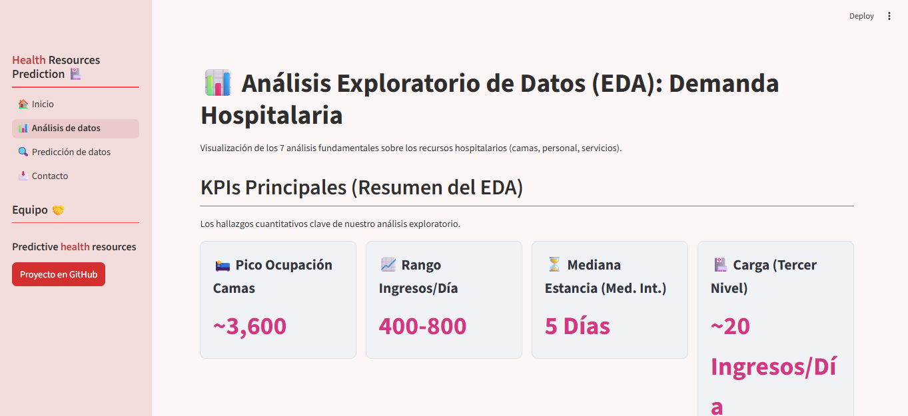

  
  
# 📈 Avance: Análisis Exploratorio de Datos (EDA) Completado
  
Para construir un modelo preciso, primero debemos entender profundamente los patrones ocultos en los datos. Hemos completado un riguroso Análisis Exploratorio de Datos (EDA) utilizando el dataset a nivel de paciente (egresos_resources_final.csv).
  
Este análisis transformó los registros individuales de pacientes en inteligencia de negocio accionable, permitiéndonos formular el siguiente conjunto de hipótesis fundamentales.
  
# 📌 Hallazgos: 4 Hipótesis Fundamentales para el Modelado
  
Nuestro EDA ha destilado la complejidad de los datos en 4 hipótesis cuantitativas y verificables. Estas no son conjeturas, sino hallazgos basados en evidencia que guiarán directamente la arquitectura de nuestro modelo predictivo.
  
- Hipótesis 1: Patrones Temporales de Demanda
La demanda diaria de ingresos hospitalarios presenta una estacionalidad semanal y anual significativa, específicamente en dos puntos:
    - Los fines de semana (sábado y domingo) tienen una demanda media significativamente menor que los días laborables.
    - Los meses de invierno (diciembre–febrero) tienen una demanda media significativamente mayor que los meses de verano (junio–agosto).  
 
- Hipótesis 2: Ocupación Real de Camas
La ocupación diaria de camas sigue un patrón estacional anual estable, con un rango intercuartílico de aproximadamente 500 camas entre el mínimo (3,100) y el máximo (3,600).  
 
- Hipótesis 3: Duración de Estancia y diagnosticos
La duración de la estancia hospitalaria varía significativamente por servicio médico. Servicios como Medicina Interna tienen estancias más largas (mediana = 5 días) que Gineco-Obstetricia (mediana = 2 días). Además, los diagnósticos de alto impacto explican más del 70% de las estancias atípicas (>10 días).  
 
- Hipótesis 4: Puntos Calientes Geográficos
La distribución de la demanda no es homogénea: las 3 entidades con mayor volumen (CDMX, Michoacán, Puebla) concentran más del 40% de los ingresos nacionales y exhiben patrones temporales distintos al promedio nacional.  
  
# 💻 Estado Actual y Sinergia con el Modelado
  
## Diseño del Dashboard de Análisis
  

  
- Para comunicar estos hallazgos, hemos diseñado y estructurado la aplicación de visualización en Streamlit. El enfoque ha sido crear una interfaz de usuario (UI) intuitiva que cuenta la historia de nuestros datos.
 
- Estructura Definida: Se ha optado por un diseño de informe vertical, que guía al usuario a través de 4 secciones lógicas (KPIs, Impulsores de la Demanda, Impacto en Recursos, Análisis Geoespacial).
 
- KPIs en Tarjetas: La aplicación presenta los hallazgos cuantitativos clave (ej. "Pico de Ocupación: ~3,600") en tarjetas de KPI para un resumen ejecutivo inmediato.
  
## Sinergia con el Modelo Predictivo
  
El proyecto se encuentra en pleno desarrollo, con la fase de prediccion avanzando en paralelo.
  
La finalización de este EDA es un hito clave, ya que nuestras 4 hipótesis fundamentales informarán y refinarán directamente el trabajo de feature engineering y entrenamiento del modelo que ya estamos ejecutando.
  